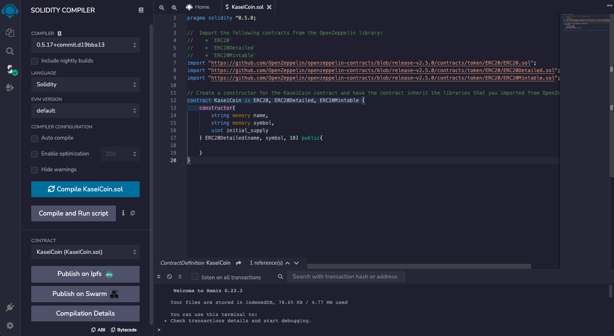
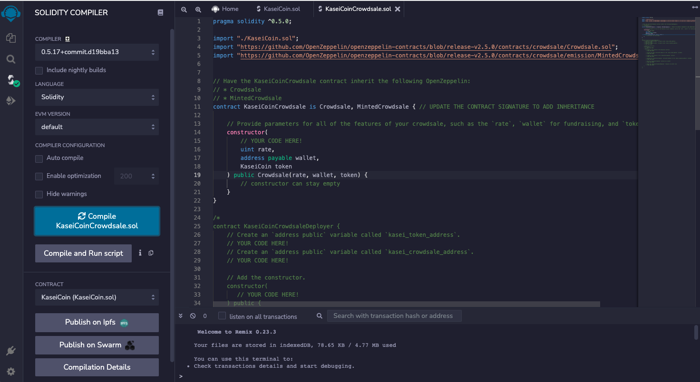
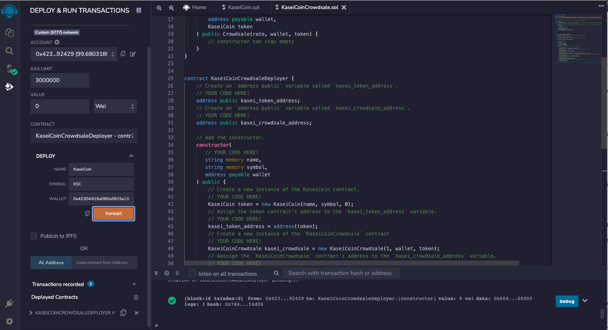
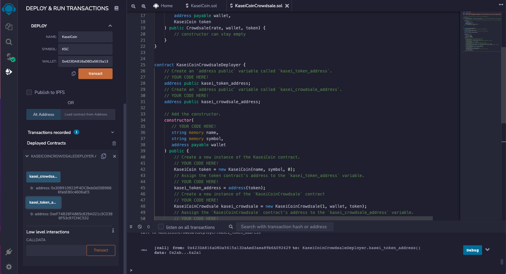
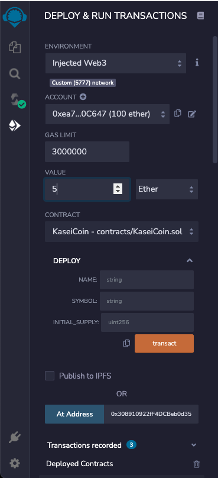
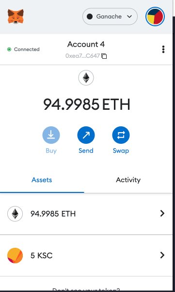
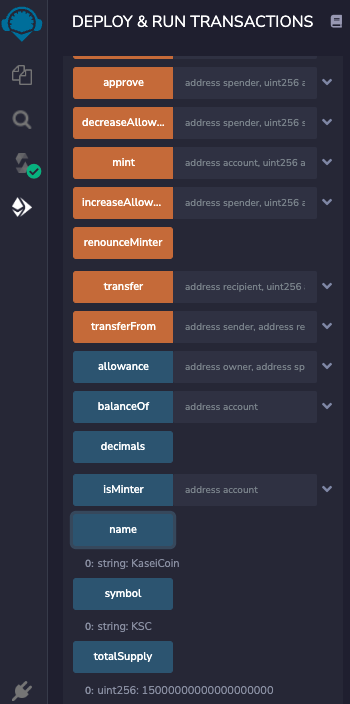

# Martian_Token_Crowdsale

## To run the program: 

Source code: KaseiCoin.sol, KaseiCoinCrowdsale.sol, KaseiCoinCrowdsale.sol_optional.sol

run this code in the Remix IDE

The program will create a fungible token (KaseiCoin) and launch a crowdsale that will allow users to purchase the KaseiCoin.

 
 

## Evaluation
### 1. Screenshots of successful compilation of KaseiCoin, KaseiCoinCrowdsale

### 2. Deploy KaseiCoinCrowdsale

### 3. Purchase KaseiCoin from KaseiCoinCrowdsale

select an account from MetaMask and enter a value to purchase KaseiCoin
 

 
enter the account number as the beneficiary
 

### 4.Verify the result

the result of account on MetaMask
 

 
the result of KaseiCoin token
 

